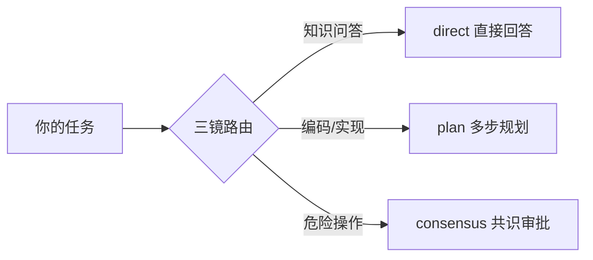

# ETO — Evolutionary Teal Organization

> Pi 是 Agent 引擎。ETO 不是另一个引擎——ETO 是让多个引擎协作的制度。

ETO 是青色组织原则翻译成 AI Agent 系统的**编排层**——跑在 [Pi CLI](https://github.com/earendil-works/pi-coding-agent) 之上，做共识、路由、安检和上下文传递。

**一句话：给你的 AI Agent 装上三镜路由 + 同侪共识 + 智子安检。**

---

## 快速开始

### 1. 安装 Pi CLI（Agent 运行时）

```bash
# Node.js (推荐)
npm install -g @earendil-works/pi-coding-agent

# 或 uv
uv tool install @earendil-works/pi-coding-agent

# 验证
pi --help
```

Pi CLI 是 Agent 引擎，提供 TUI、工具调用、会话管理、provider 抽象。ETO 跑在 Pi 之上。

### 2. 一键安装 ETO

**Windows (cmd):**
```cmd
curl -O https://raw.githubusercontent.com/reoroy/evolutionary-teal-organization/main/install.cmd
install.cmd
```

**Windows (PowerShell):**
```powershell
irm https://raw.githubusercontent.com/reoroy/evolutionary-teal-organization/main/install.ps1 | iex
```

**Mac / Linux / WSL:**
```bash
make setup
```

安装完成后，启动 Pi 即自动加载 ETO：

```bash
# 本地模型（Ollama）
pi

# 或走 Claude 代理
run-eto.cmd          # Windows
./run-eto.ps1        # PowerShell
```

### 3. 首次启动

启动后 ETO 会引导你：
1. 选择 LLM Provider（DeepSeek / Ollama / 跳过）
2. 然后直接描述你的第一条任务

---

## 核心功能

### 三镜路由 — 任务自动分类

你说一句话，ETO 自动分析任务类型并路由到合适的处理路径：



**示例：**

| 你说的 | 路由结果 | 行为 |
|:-------|:---------|:-----|
| "什么是 Rust 的 ownership？" | direct → researcher | 直接回答 |
| "帮我写一个 Python 爬虫" | plan → coder | 多步执行 |
| "删除生产数据库" | consensus → auditor | 触发共识审批 |

路由后端可配置：DeepSeek API（语义路由）或 Ollama 本地模型（关键词降级）。

### 同侪共识 — 三阶段评审

对风险操作，三个 AI 角色独立评审，杜绝单点决策：

```
T1: 独立评分
   researcher ──→ {score, concern, suggestion}
   coder      ──→ {score, concern, suggestion}
   auditor    ──→ {score, concern, suggestion}

T2: 审议（分歧 > 0.2 时触发）
   各 peer 看到其他人的意见，重新评分
   最多 2 轮，防止无限循环

T3: 终审（审议后分歧仍大）
   auditor 做终审裁决 → approve / revise / reject
   输出改进行动项
```

每个 peer 可配置不同的 LLM provider：

```json
{
  "peers": {
    "researcher": { "provider": "ollama",   "model": "qwen2.5-coder:7b" },
    "coder":      { "provider": "deepseek", "model": "deepseek-chat"    },
    "auditor":    { "provider": "claude",   "model": "claude-sonnet-4-6" }
  }
}
```

配置在 `~/.pi/eto-config.json`，改完自动生效。

### 智子安检 — 安全门禁

可配置规则引擎，在危险操作前拦截：

```json
{
  "rules": [
    { "trigger": "bash", "pattern": "rm\\s+-rf",  "action": "confirm" },
    { "trigger": "bash", "pattern": "dd\\s+if=",  "action": "block"   }
  ]
}
```

| 动作 | 效果 |
|:-----|:------|
| `confirm` | 弹窗确认，你决定 |
| `block` | 直接拦截，不弹窗 |
| `log` | 放行但记录审计日志 |

配置：`~/.pi/eto-sentinel.json`，热重载。

### MCP 集成 — 调其他 Agent / 被其他 Agent 调

ETO 提供 MCP Server，让任何 MCP 客户端（Claude Code、Cursor 等）直接调用 ETO 的共识和路由：

```json
// .mcp.json
{
  "mcpServers": {
    "eto": {
      "command": "python",
      "args": ["-m", "eto.mcp_server"]
    }
  }
}
```

**暴露的工具：**

| 工具 | 作用 |
|:-----|:------|
| `eto_consensus` | 对执行计划做三阶段共识评分 |
| `eto_route` | 三镜路由分析任务 |
| `eto_peer_config` | 查看 peer→provider 映射 |

**peer 也可以配置走 MCP 调其他 Agent：**

```json
{
  "peers": {
    "auditor": {
      "provider": "mcp",
      "mcp_server": ["python", "-m", "auditor_agent_mcp"],
      "mcp_tool": "audit_review"
    }
  }
}
```

这意味着你可以让 Reasonix、Claude Code 或其他 Agent 参与 ETO 的共识评审。

---

## 日常使用

### 启动

```bash
# 交互模式（TUI）
pi

# 走 Claude 代理
run-eto.cmd

# 一次性查询
pi -p "帮我分析这段代码的性能瓶颈"

# 指定 provider
pi --provider deepseek --model deepseek-chat
```

### 智子命令

在对话中输入：

| 命令 | 作用 |
|:-----|:------|
| `/sentinel-reload` | 热重载安检配置 |
| `/metrics` | 查看运行统计 |

### 开发命令（ETO 自身开发）

如果你要修改 ETO 本身：

```bash
# 先安装开发依赖
pip install -e eto/

# 运行测试
python eto/stitches/test.py

# 发布
make release V=v0.x.0
```

完整的开发工作流见 [开发流程文档](.claude/rules/eto-guide.md)。

---

## 卸载

```bash
# Windows
uninstall.cmd

# PowerShell
./uninstall.ps1

# 手动
pi remove eto/extensions/eto.ts
rm -rf ~/.eto ~/.pi/etoprofiles ~/.pi/eto-config.json
```

---

## 架构（5 组件，<1000 行）

```
                         ┌──────────────┐
                         │   智子守卫   │  ← 安全门禁 + 流程强制器
                         └──────┬───────┘
                                │
Agent A ──→ 三镜路由 ──→ 协调员选举 ──→ 同侪共识 ──→ Pi 执行
Agent B ──→ (按 Profile 匹配) (match×空闲率) (peer 评分)    │
Agent C ──→                                            TealContext
                                                       (共享上下文池)
                        ↓
               Agent Profile 注册表
               (specialty/style/ICP/skills/MCP_tools)
```

| 组件 | 做的事 | 不做什么 |
|:-----|:-------|:---------|
| **三镜路由** | 分析任务→匹配 Profile→分给最合适的 Agent | 不写 Agent 逻辑 |
| **协调员选举** | 按匹配度+空闲率选临时负责人 | 不建固定层级 |
| **同侪共识** | 三阶段评分→审议→终审 | 不搞一言堂 |
| **智子守卫** | 安全检查 + 强制流程 | 不替 Agent 做决定 |
| **TealContext** | 共享上下文池，Agent 互相看见 | 不取代 Pi 的会话管理 |

### 铁律

1. **Pi 有的绝对不写** — TUI、工具调用、会话管理、provider 抽象、Agent 运行时
2. **ETO 只写编排层** — 路由、选举、共识、安检、上下文传递
3. **代码量 < 1000 行** — 超过说明在造轮子
4. **先问"Pi 有没有"** — 有就直接用

### 历史教训

- ❌ 写了 3156 行 Python — 其中 95% 是 Pi 已有的功能
- ✅ 删到 TypeScript Extension + Python stitches — 才意识到 ETO 的正确形态
- **核心：ETO 做薄编排层跑在 Pi 之上，不是重写整个栈。**

---

## 项目结构

```
eto/
├── extensions/eto.ts        — Pi Extension（入口 + 路由 + 安检）
├── mcp_server.py            — MCP Server（供其他 Agent 调用）
├── mcp_client.py            — MCP Client（调其他 Agent）
├── stitches/
│   ├── consensus/vote.py    — 三阶段共识（评分→审议→终审）
│   ├── election/elect.py    — 协调员选举
│   ├── comms/a2a.py         — 多步任务执行
│   └── test.py              — 集成测试
├── bootstrap/               — 首次初始化
├── install.cmd / .ps1       — 一键安装
├── uninstall.cmd / .ps1     — 一键卸载
├── run-eto.cmd / .ps1       — 启动脚本（走 Claude 代理）
└── verify-eto.cmd           — 安装验证
```

---

## 配置

| 文件 | 用途 |
|:-----|:------|
| `~/.pi/eto-config.json` | 路由 provider + peer→provider 映射 |
| `~/.pi/eto-sentinel.json` | 智子安检规则 |
| `~/.pi/etoprofiles/profiles.json` | Agent Profile 数据 |
| `~/.eto/memory/` | 引导进度 + 经验数据 + 审计日志 |

---

## License

MIT
